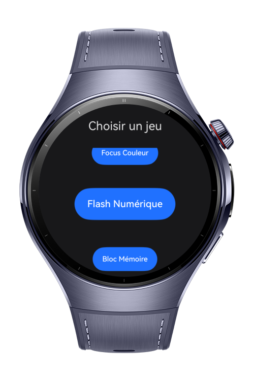
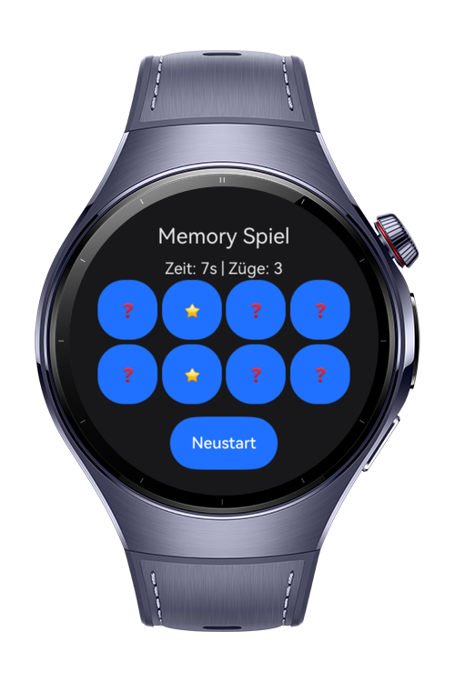
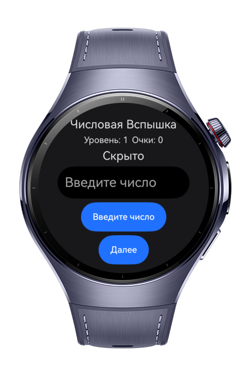
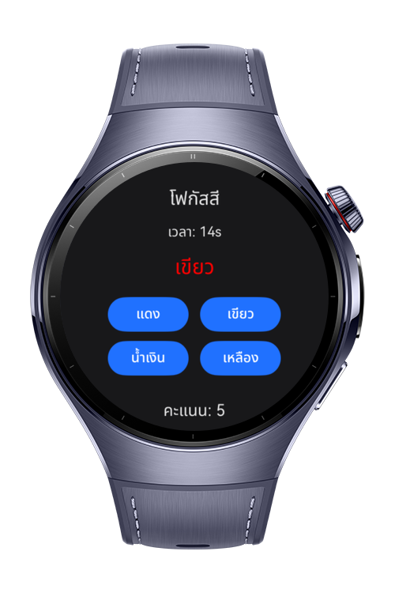

> **Note:** To access all shared projects, get information about environment setup, and view other guides, please visit [Explore-In-HMOS-Wearable Index](https://github.com/Explore-In-HMOS-Wearable/hmos-index).

# Brain Games 

A collection of lightweight mini mind games optimized for Huawei smartwatches.
Includes Memory Grid (matching), Number Flash (quick memory), and Color Focus.
Built entirely with HarmonyOS (ArkTS).
Features multi-language support, responsive grid layout, language listeners.

# Preview
<div>
  
  
  
  
</div>

# Use Cases

- Memory improvement

- Visual focus & attention

- Fast thinking

- Eye–mind coordination

- Quick brain exercises on a watch

# Technology
## Stack
- **Languages**: ArkTS, ArkUI
- **Frameworks**: HarmonyOS 6.0.0 Beta3
- **Tools**: DevEco Studio 6.0.0.828
- **Libraries**:
    - `@kit.ArkUI`
    - `@ohos.arkui.ArcList`

# Directory Structure

```
entry/
├── src/main/
│ 
├── src/main/ets/
│ ├── viewmodel/
│ │ ├── langStore.ets
│ │ └── translations.ts
│ │
│ ├── entryability/
│ │ └── EntryAbility.ets
│ │
│ ├── entrybackupability/
│ │ └── EntryBackupAbility.ets
│ │
│ ├── pages/
│ │ ├── GameColorFocus.ets
│ │ ├── GameNumberFlash.ets
│ │ ├── GameMemoryBlock.ets
│ │ ├── SelectGamePage.ets 
│ │ ├── LanguagePage.ets
│ │ ├── Index.ets
│ │
```

# Constraints and Restrictions
## Supported Device

* Huawei Watch 5

# License

**Brain Game** is distributed under the terms of the MIT License

See the [LICENSE](./LICENSE) for more information.